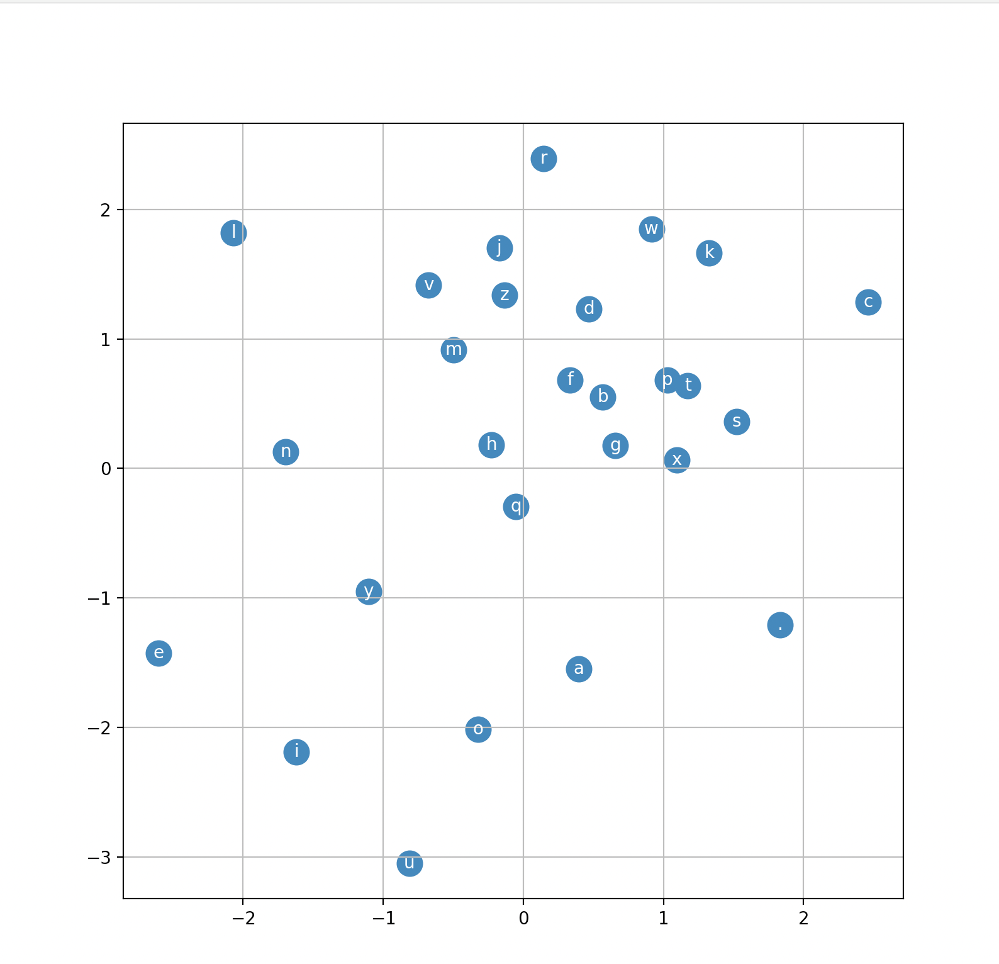

# makemore

makemore takes one text file as the input, where each line is assumed to be one piece of training data, and generates more text like that in a given text file (ex: if the given text file is a list of names, makemore generates more names). It is an autoregressive character-level language model, with bigram, MLP) models.

This project is for educational purposes and follows the course [Neural Networks: Zero to Hero by Andrej Karpathy](https://www.youtube.com/watch?v=PaCmpygFfXo&list=PLAqhIrjkxbuWI23v9cThsA9GvCAUhRvKZ&index=2).

Note that training and thus outputs are significantly hampered by no access to GPUs.

***Source code is commented to demonstrate independent understanding of core concepts as well as for ease of future read-throughs. Additional coding files used during independent learning process are also included. Annotated research papers that implemented models are based on are also included.***
___

## Brief Model Descriptions
- **bigram:** one character predicts the next character with a lookup table of counts from name.txt data
- **bigram_nn:** one character predicts the next character with neural network trained on name.txt data
- **mlp:** a set length of characters predict the next character with a multi-layer perceptron model trained on name.txt data

## Key Papers That Current Implementations Follow
- [A Neural Probablistic Language Model](https://github.com/AngelaYu-3/makemore/blob/main/annotated_papers/MLP_paper.pdf)
- [Batch Normalization: Accelerating Deep Network Training by Reducing Internal Covariate Shift](https://github.com/AngelaYu-3/makemore/blob/main/annotated_papers/batchNorm_paper.pdf)
- [Language Models are Few-Shot Learners](https://github.com/AngelaYu-3/makemore/blob/main/annotated_papers/openAI_LLM.pdf)

___

## Output
MLP output dictating proximity of letters trained on dataset for 200,000 steps, dimension of 2, batch-size of 32, and 200 hidden layers. Note, usually would train with much more than 2 dimensions for better results, but for the sake of visualization, only used 2 dimensions to output this figure.

___

## Included Dataset

The included example **names.txt** dataset has the most common 32K names taken from [ssa.gov](https://www.ssa.gov/) for the year 2018.

___

## Selected Questions

**Q: For bigram.py, why do we want to use nll loss function? Why does using log loss function make working with probabilities in MLPs better?**

A: log loss function is monotonic (when a function is always increasing or always decreasing) **(why does log being monotonic important for finding loss of probabilities in this mlp model?)**

**Q: What is the point of regularization?**

A: Encourages model to be more generalized instead of memorizing the data. Reduces overfitting of the model (when the model learns training data too closely, including noise and irrelevant details, leading to poor performance on new training data). 

___

## License
MIT
